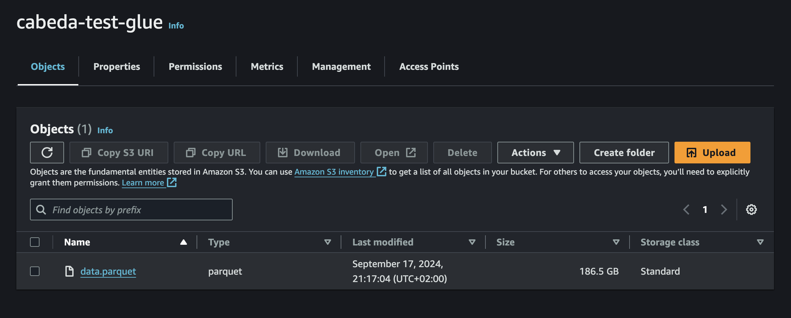
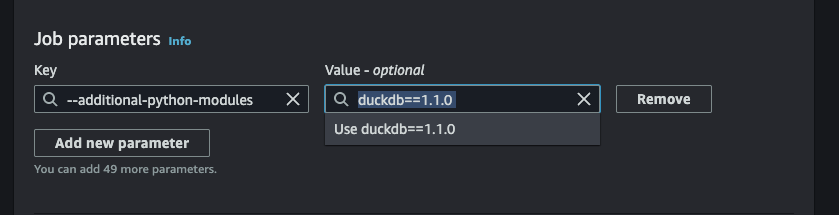

*So, with me having to do a bit more with AWS glue, I have a couple of features I would like to test out on the platform. One of those is to test if we could run DuckDB on it and how it would fare with a constrained instance. At first, I thought the minimum was the 2 DPU's plus a spark environment setup but after a closer look AWS Glue is able to scale down to a single DPU or 1/16 DPUs ig we forego spark and just want to run glue python scripts. With this I decided to see how useful would this be for a normal workload.

## The test

For this article I decided to do the following:

1. process a small dataset (1GB) using DuckDB and see how it performs.
2. Retrieve the dataset from an s3 bucket
3. Process it and write it back to another s3 bucket.

Run all the steps above using the smallest DPU available (1/16 DPU) and see how it performs.



> Note: At first I planned on running DuckDB through Ibis. Some people are put off by the SQL interface and Ibis provides a stop gap for that. However, Ibis requires python 3.9 and AWS Glue python scripts run only 3.8.

## Running DuckDB directly

I started by generating the dataset locally using the following code:

```sql

SELECT hash(i * 10 + j) AS id, IF (j % 2, true, false)
                 FROM generate_series(1, 50) s(i)
                 CROSS JOIN generate_series(1, 5000000) t(j))
                 TO 'data.parquet'

```

However, a big problem with this approach is that uploading a 2 GB file was a slow. So I decided to actually start by testing how DuckDB would run on glue generating this file and uploading it to s3.

Using the AWS Console I went to AWS Glue > create job > script editor and chose `Python shell` as my engine.


Before adding to the script we need two things:

1. Install DuckDB
2. Choose an IAM role (I used an admin)

Any additional libraries can be added to the script by adding by setting the `--additional-python-modules` job parameter and adding, in my case, the value `DuckDB==1.1.0`.



With this setup I was ready to test DuckDB.

To warm up I just wanted to test if I could run the engine which I was successul by running the following code:

```python

import DuckDB

DuckDB.sql("SELECT 1")

```

yay!!!

As we now were certain that dudckdb run on glue I need to make sure that we could load extensions. For this test I needed two, `aws` to retrieve the credentials and `httpfs` to upload and read from s3. With this features I added a secret pointing to the credential_chain (this in turn uses the job's associated IAM role) and moved the sql data generator inside a [copy statement](https://DuckDB.org/docs/sql/statements/copy.html). All this as seen below:

```python

import DuckDB

DuckDB.sql("""CREATE SECRET (
    TYPE S3,
    PROVIDER CREDENTIAL_CHAIN
);""")

DuckDB.sql("""
        COPY (
        SELECT hash(i * 10 + j) AS id, IF (j % 2, true, false)
         FROM generate_series(1, 50) s(i)
         CROSS JOIN generate_series(1, 5000000) t(j)
         ) 
         TO 's3://cabeda-test-glue/data_2GB.parquet'""")
```

To test it out I quickly run locally with success but, as soon as I ran it on glue I got the following error:

**`IOException: IO Error: Failed to create directory "/.DuckDB/": Permission denied`**

This was a bit weird and had to run a lot of iterations until I understood the root issue. Glue has a readonly filesystem and the extensions were trying to write to the home directory. To fix this I had to set the home directory to a writable location through the `home_directory` variable. In this case glue provides `tmp` so I got it working by adding `SET home_directory='/tmp'`.

In the end the code looked like this:

```python

import DuckDB

DuckDB.sql("SET home_directory='/tmp';")

DuckDB.sql("""CREATE SECRET (
    TYPE S3,
    PROVIDER CREDENTIAL_CHAIN
);""")

DuckDB.sql("""
        COPY (
        SELECT hash(i * 10 + j) AS id, IF (j % 2, true, false)
         FROM generate_series(1, 50) s(i)
         CROSS JOIN generate_series(1, 5000000) t(j)
         ) 
         TO 's3://cabeda-test-glue/data_2GB.parquet'""")

```

Quite simple!

> Fun note: On my first run the job took almost 30 minutes to run. When I looked at the file instead of the expected 2GB I had just generated a 186 GB file. So, by mistake I was actually able to show how well DuckDB is able to adapt to scarce resources and still handle the job.


## Access the data

We were able to prove that we could run DuckDB on glue and generate parquet files. But can we access the data in a cost effective way?

Well, thankfully the parquet extension plus the httpfs extension is quite performant. I did a quick test by accessing the file, retrieving a subset of 1 million rows and then writing it back to another s3 bucket. The code for this is below:

```python

import DuckDB

DuckDB.sql("SET home_directory='/tmp';")


DuckDB.sql("""CREATE SECRET (
    TYPE S3,
    PROVIDER CREDENTIAL_CHAIN
);""")


t = DuckDB.sql("SELECT * FROM 's3://cabeda-test-glue/data_2GB.parquet' limit 1000000").df()

print(t.head())

DuckDB.sql("copy t to 's3://cabeda-test-glue/data_limit.parquet'")

```

And this run in just 30 seconds. Quite impressive!


## Final thoughts

So, why use DuckDB inside a glue job? Well, DuckDB is quite powerful, and being able to read s3 data and quickly process it for a fraction of the cost of a spark job is great. SO, for teams that have are using AWS Glue and to process files and have a bug monthly bill this is an easily swapable migration.

Personally I'm hoping this will turn into an even bigger trend as soon as DuckDB gains the ability to read directly from glue data catalog and operate on apache iceberg tables. At that point there's no reason to use spark unless you're dealing with petabytes of data.
*
