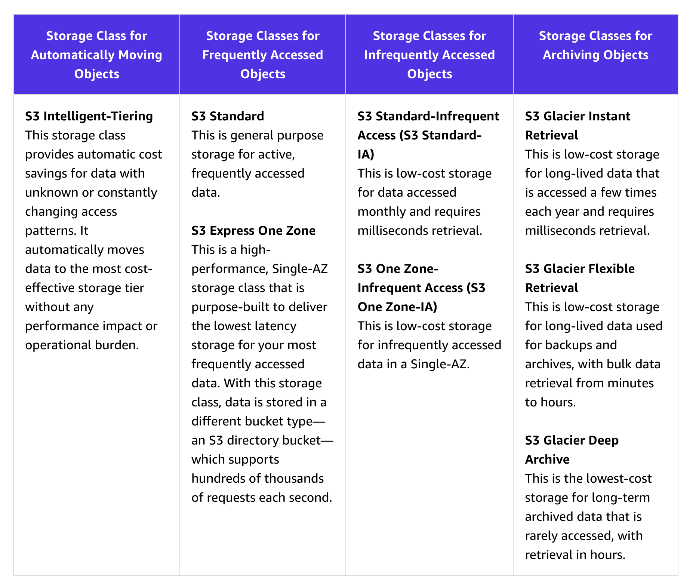
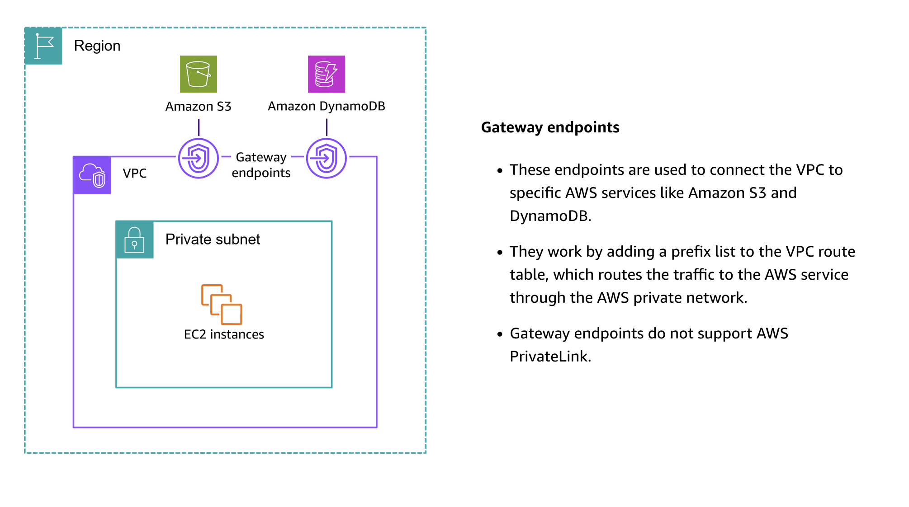
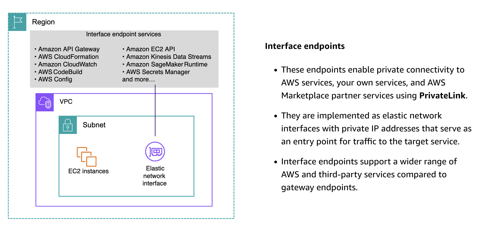
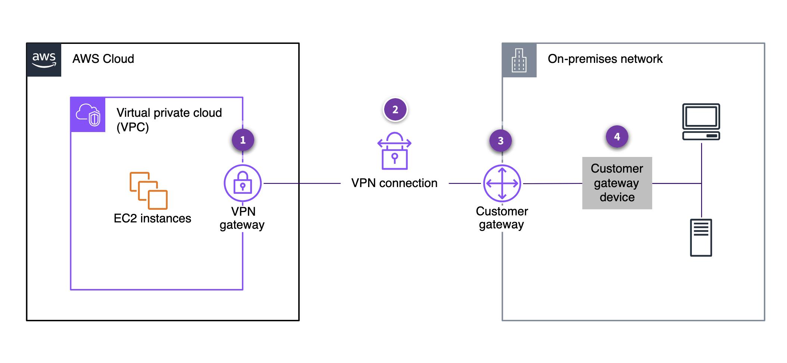

So, I've done my AWS Data Engineering certification on the 25th October. To help me prepare for the exam I've written down some notes. Hopefully they'll be useful to someone else too.

> Note: This is planned to be a long post and not something to be read like a normal post. I'm writing this as a way to better organize my thoughts.

## Courses done

- Udemy data engineering course
  - https://vwds.udemy.com/course/aws-certified-data-engineer-associate-dea-c01
  - https://vwds.udemy.com/course/aws-data-engineer
- Udemy Glue course (as a refresher)
- AWS Skill Builder (payed for 1 month before exame)

Going through both the official preparation and the Udemy courses, I'd say to go for the official course if you want to get the best exam test experience. However Udemy is cheaper, provides way more courses and has a lot of exams to test out (like [this](https://vwds.udemy.com/course/practice-exams-aws-certified-data-engineer-associate-r)) although the questions quality may vary. You can check the recommendations on this [PDF](https://d1.awsstatic.com/training-and-certification/docs-data-engineer-associate/AWS-Certified-Data-Engineer-Associate_Exam-Guide.pdf) .****

## My timeline

I've set out to do this exam initially at the end of July but sadly I had an accident and had vacations after recovery. I did one Udemy course in July but to prepare for the exam I took to the AWS course during October. If you are confident on your skills one month to study is more than enough with a bit of focus. If doing this less intensively I'd say 2/3 months is a good timeline.

## Notes by services

With my previous experience there's a base knowledge that I think I've gathered. In this section I'll be focusing on writing about the services and/or features I don't know about.

### S3

**What is S3 object lock?**

[Source](https://docs.aws.amazon.com/AmazonS3/latest/userguide/replication.html)

- Requires S3 bucket versioning
- Prevents s3 objects from being deleted or overwritten
- There are 2 mechanisms:
  - Retention period: objects can't be deleted or overwritten until the retention period expires
  - Legal hold: objects can't be deleted or overwritten until the legal hold is removed. Can be set by anyone with `s3:PutObjectLegalHold` permission
- This means that if we upload a new object with the same name it will be versioned and we can request the old one by providing the version id
- To set a retention period, you must have the s3:PutObjectRetention permission.
- S3 Object Lock provides two retention modes that apply different levels of protection to your objects:
  - Governance mode: can be deleted by users with specific permissions `s3:BypassGovernanceRetention` and explicity pass `x-amz-bypass-governance-retention:true` header.
  - Compliance mode: can't be deleted by anyone. Including the root account.

S3 tiers:

- S3 select is being deprecated. Not even enabled for new aws accounts.

- Only Standard Amazon SQS queue is allowed as an Amazon S3 event notification destination, whereas FIFO SQS queue is not allowed

- object metadata can't be encrypted

**How can I replicate objects within and across regions?**

[Source](https://docs.aws.amazon.com/AmazonS3/latest/userguide/replication.html)

- can enable automatic replication
- There are 2 types of replication:
  - Live replication: for new and updated objects
  - on-demand replication: for existing objects

S3 batch replication allows to:

- Replicate existing objects
- replicate previous failed to replicate objects
- replicate objects that have already been replicated
- replicate replicated ojects

- Adding an S3 access point to a bucket doesn't change the bucket's behavior when the bucket is accessed directly through the bucket's name or Amazon Resource Name (ARN). All existing operations against the bucket will continue to work as before. Restrictions that you include in an access point policy apply only to requests made through that access point.

- Amazon S3 Object Lambda allows you to add custom code to process data retrieved from S3 before returning it to an application

### Redshift

- Copy command allows for parallel processing (up to the number of nodes)
- [Datashares](https://docs.aws.amazon.com/redshift/latest/dg/lf_datashare_overview.html)
  - Using datashares we can share data across provisioned clusters, serverless workgroups, Availability Zones, AWS accounts, and AWS Regions. You can share between cluster types as well as between provisioned clusters and serverless.
  - Supported only on RA3 nodes
  - These shares include databases, schemas, tables, views (including regular, late-binding, and materialized views), and SQL UDFs.
- Redshift Managed Storage: allows for automatic scaling of storage
  - RMS provides the ability to scale your storage to petabytes using Amazon S3 storage
  - Automatically uses high-performance SSD-based local storage as tier-1 cache.
- Redshift provides native IdP integration

### Amazon Comprehend

- Can be used to extract entities, key phrases, language, sentiment, and syntax from text

### Amazon Macie

- Can be used to discover, classify, and protect sensitive data on S3
- Can be used to validate for PII before processing in an ETL pipeline

### DMS

- Can be used to migrate data from on-premises to the cloud
- Can be used for one time migrations or continuous replication
- Allows for continuous data replication through change data capture (CDC)
  - Can be insert only or full replication (delete and updates included)

### Kinesis

Is divided in these services:

- Kinesis Data Streams: for real-time data streaming
- Kinesis Data Firehose: for loading data into data stores
- Kinesis Video Streams: for real-time video streaming

Furthermore we have Amazon Managed Service for Apache Flink

Kinesis Agent is a pre-built java library to processs files into Kinesis Data Streams.

- It allows other languages to run by using a MultiLangDaemon

MSK is a fully managed Kafka service.

- Data masks
  - Shuffling is a data masking that reorders the data in a column. This is useful when you want to preserve the data distribution but not the actual values.

### AppFlow

- Can be used to transfer data between SaaS applications and AWS services like S3, Redshift, and RDS
- Serves as a "fivetran" for AWS

### AWS Transfer Family

- Can be used to transfer files to and from S3 over SFTP and FTP
- for simpler transfers

### DataSync

- Allows for data transfer between on-premises and AWS
- Can be used to transfer data to and from S3, Network File System (NFS), and Server Message Block (SMB)
- Prefered solution for large data transfers

### Aws Snow

- There are 3 types of Snow devices:
  - Snowcone: smallest device
  - Snowball: for large data transfers
  - Snowmobile: for exabyte-scale data transfers. However, AWS has discontinued this service

### API Gateway

We can use it's cache features to cache responses from our API. This can be useful to reduce the number of requests to our backend.

### Elasticache

- Can be used to cache data in-memory
- Supports Redis and Memcached

### Step Functions

- Doesn't require DAG's
- To implement retries with backoff we can use `BackOffRate`

### OpenSearch

**How do make sure the Kinesis data stream is scalable writing to opensearch?**

- When you choose the number of shards, you must distribute an index evenly across all data nodes in the cluster. However, these shards should not be too large or too numerous. A general guideline is to keep shard size between 10–30 GiB for workloads where search latency is a key performance objective. Keep shard size between 30–50 GiB for write-heavy workloads such as log analytics.

### Cloudtrail

- Can be used to log all API calls made in your account
- By enabling lake we can then use SQL to query the logs

### AWS Resource Access Manager (RAM)

- Can be used to share resources across accounts

### Glue

- A crawler can accelerate by:
  - Sampling the data
  - Setting incremental crawls (read only new folders)
  - Enabling event driven crawl (triggered by new data)
- AWS Glue partition indexes are a performance optimization feature that accelerates queries on partitioned data sources.
  - Partition indexes store metadata about the partitions in a columnar format for faster partition pruning to reduce the amount of data that needs to be scanned during queries.
- Each file stored inside a partition should be at least 128 MB to a maximum of one GB to get ensure that AWS Glue (Spark) can read and process the data efficiently.
- AWS Glue keeps track of bookmarks for each job. If you delete a job, you also delete the job bookmark. If for some reason, you need to reprocess all or part of the data from previous job runs, you can pick a bookmark for Glue to start processing the data from that bookmark onward. If you need to re-process all data, you can disable job bookmarks.
- When working with CSV, json and xml we can use a feature named group files to store multiple files in a single in-memory partition.

## Glue databrew

- Can be used to clean and normalize s3 data (needs to be a file)
- Doesn't support table formats

### Kinesis

Kinda basic but I keep forgetting as I don't use it that much, the possible shardIteratorTypes are:

- AT_SEQUENCE_NUMBER: Start reading from the position denoted by a specific sequence number, provided in the value StartingSequenceNumber.
- AfterSequenceNumber: Start reading right after the position denoted by a specific sequence number, provided in the value StartingSequenceNumber.
- AT_TIMESTAMP: Start reading from the position denoted by a specific time stamp, provided in the value Timestamp.
- TRIM_HORIZON: Start reading at the last untrimmed record in the shard in the system, which is the oldest data record in the shard.
- LATEST: Start reading just after the most recent record in the shard, so that you always read the most recent data in the shard.

### AWS Serverless Application Model (SAM)

- Can be used to deploy serverless applications
- Simplified development and deployment process
- Local testing capabilities
- Seamless AWS services and resources integration
- Although CloudFormation provides a broader service to provision AWS infrastructure and resources, AWS SAM provides a simplified syntax for serverless resources.

### Networking

> This is one of the my weakest areas.

- VPC provides two types of endpoints:
  - Gateway endpoints: for S3 and DynamoDB
    - This one has no additional cost
  - Interface endpoints: for other services (although it can be used to connect to S3 and DynamoDB as well)
    - These VPCS are the ones that can be accessed by on-premises through VPN or Direct Connect

- Security groups are stateful
- Network ACLs are stateless

- VPC peering: allows to connect two VPCs
- For connection to on-premises we can use site-to-site VPN

- Direct connect can be used to connect to on-premises bypassing the open internet (going through AWS backbone)
  - Direct Connect involves significant monetary investment and takes at least a month to set up

- Private link can be used to expose services to other VPCs without exposing them to the internet.
- This means we no longer need internet gateway, NAT device or a public IP for the VPC

### IAM

- There are 2 types of policies:
  - Identity-based policies: attached to IAM users, groups, and roles
  - Resource-based policies: attached to resources like S3 buckets, SQS queues, and SNS topics
- IAM endpoints serve as the entry point for the applications to send requestss

### EMR

- EMRFS is a file system layer built on top of Amazon S3, allowing you to seamlessly access and process data stored in S3 as if it were a local file system
- HDFS is better suited if we need the fastest IO possible as it gives the ability to process data by using cached results as hot storage.

### Quicksight

QuickSight's Generative Business Intelligence (BI) feature leverages machine learning to automate data analysis tasks, including identifying patterns, trends, and anomalies in the data, and generating relevant visualizations and insights.

### Athena

- Partition projection: a feature that allows you to define partitions in your table schema without actually creating the partitions in Amazon S3. This feature is useful when you have a large number of partitions and you want to avoid the overhead of creating and managing them in Amazon S3.
  - AWS considers this as a faste solution
  - Leaves me with doubts if it isn't a way to close source the data as the metadata is hidden from services that want to access the table directly

### Session Manager

- Can be used to manage EC2 instances without the need for SSH

### AWS Application Discovery Service

Using Application Discovery Service APIs, you can export the system performance and utilization data for your discovered servers. Input this data into your cost model to compute the cost of running those servers in AWS. Additionally, you can export data about the network connections that exist between servers. This information helps you determine the network dependencies between servers and group them into applications for migration planning.

It has two components:

- AWS Application Discovery Agent: a small footprint software that you install on your on-premises servers to collect data about your server configuration and the network connections between them.
- AWS Application Discovery Connector: a software that you install on a server in your data center to collect metadata about your servers and storage.

### AWS Application Migration Service

- AWS Application Migration Service (MGN) is a highly automated lift-and-shift (rehost) solution that simplifies, expedites, and reduces the cost of migrating applications to AWS.

### AWS Storage Gateway

- Can be used to connect on-premises storage to AWS

### AWS Shield

- Can be used to protect against DDoS attacks
- There are two versions:
  - Standard: included with AWS at no additional cost
  - Advanced: paid service that provides additional protection

### AWS GuardDuty

- Can be used to monitor for malicious activity in your account
-

### MWAA

- Has a no code feature. I've worked with airflow before and never gotten to use no code editor 🤔

### DynamoDB

- Local secondary indexes are created at the same time that you create a table. You cannot add a local secondary index to an existing table, nor can you delete any local secondary indexes that currently exist.
- For each table in DynamoDB, you can create up to 20 global secondary indexes and 5 local secondary indexes.

## Final thoughts

It has been interesting to get the AWS Certification. I've gotten to learn quite a bit on specifics of the aws services which I'll surely be using them in the future. It provides a good baseline or even update on the available services (i.e. redshidt materialized views, datashares and even lake formation) but if you are already working with these services experiences beats by far this. Or just write an article on the services you don't know about (which is what I have planned for the next couple of months).
