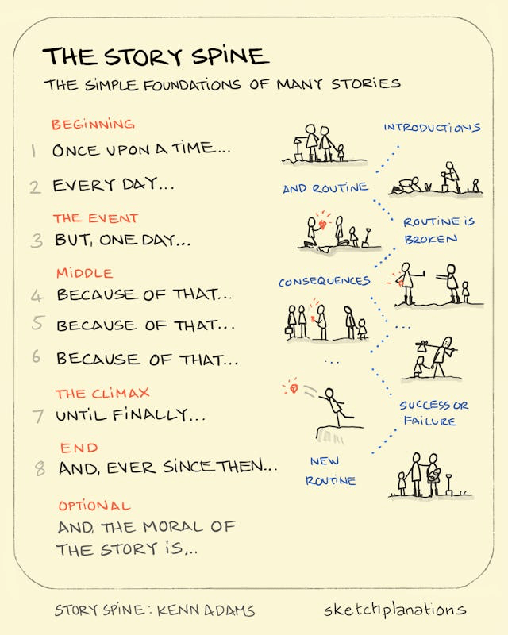

#### [Let's Consign CAP to the Cabinet of Curiosities - Marc's Blog by Marc Brooker](https://brooker.co.za/blog/2024/07/25/cap-again.html)

Interesting topics to research a bit more on CAP alternatives

#### [Why Your Generative AI Projects Are Failing by Ben Lorica 罗瑞卡](https://gradientflow.substack.com/p/why-your-generative-ai-projects-are)

In summary, to have a good AI product we need to have data with quality which requires good data governance. With this data we need to define useful products that we can measure it's value using data driven metrics. We must also ensure the product has good practices avoiding security or bias issues

#### [Engage your audience by getting to the point, using story structure, and forcing specificity – Ian Daniel Stewart](https://iandanielstewart.com/2024/06/09/engage-your-audience-by-getting-to-the-point-using-story-structure-and-forcing-specificity/)

Resumed by:

#### [Slack Conquers Deployment Fears with Z-score Monitoring - InfoQ by Matt Saunders](https://www.infoq.com/news/2024/03/slack-z-score-monitoring/)

This is something I would love to implement. Allowing to define the metrics on which to evaluate a new feature, the expected hypothesis and revert the feature (i.e feature flags) automatically with a report on the experiment

#### [DuckDB + dbt : Accelerating the developer experience with local power - YouTube](https://www.youtube.com/live/Baoay4k2b34?si=LCb5LbGzyJ4iCKaD)

Could I replace Athena with this? I think the main blocker for me is I want to work with S3. And need to check how it runs for a really large dataset…

#### [How Unit Tests Really Help Preventing Bugs | Amazing CTO](https://www.amazingcto.com/how-unit-tests-find-prevent-bugs/)

Good tip. For any project define the metric of code coverage goals and start increasing on the project
