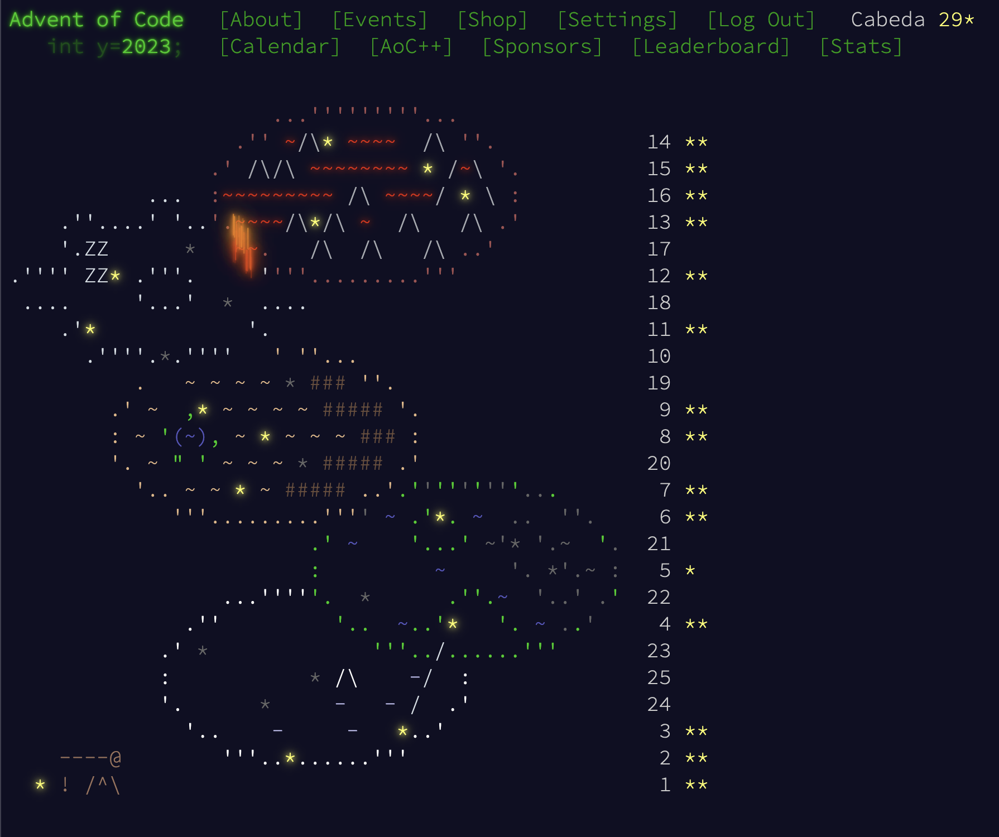

## Semester review

So, the 2023Q2 semester has ended. I feel like I needed just a bit of more time to finish it but it's important to keep with the established time and review where I can improve.

So, I set myself to go from September to the beginning of January with 5 subjects.

- Web Dev
- Code challenges
- Data Stream
- Communication
- Sports

Starting with Web Dev, at the time I was coding a lot with Typescript and felt this was a topic to focus on. However, I never got myself to do anything specific on this subject outside of work. And looking forward I also think having a subject focused on this won't be of help.

But looking into the second subject, code challenges I had a much more well defined way of improving my code skills and get to 100%. At first I was looking into doing LeetCode each week and then moved into doing Advent of Code 2024.

For the advent of Code, I got to do 29 of the total 50 challenges (68%). Although my goal wasn't only to do the challenges but also to write them in Rust alongside Python, I've found lot's of interesting algorithms. On top of that it made me realise I am too reliant on brute force methods as most of the issues I have are on writing data pipelines or CRUD apps.

I feel I need to improve my skills on coding so making sure I get good code problems is a must for the next semester.

Going now to the Data Stream project, this is one project I'm quite happy with (although at the end I did very little on streaming data). I got to do a talk again on a local meetup and have people interested on the dataset for research. The project is open sourced (on github)[https://github.com/cabeda/porto-stcp-realtime] and I've mostly used python, dbt and duckdb. You can check more on [talks](/talks).

The communications has a subject didn't pan out. I feel the need to put myself more out there but it should be ingrained into the projects like I did with Data Stream.

At last, because I care very much on having good health I kept logging on my effort to do more exercise. The goal was to have a 3 day per week exercise which I've kept I'd say half of the time. However I think this is a subject that can be expanded a bit in scope.

In the end I can say that having delimited periods of time to do the work and keeping this week updates on my personal blog have given me a small boost of confidence and helped me keep the focus.

## Semester 2 plan

And with one Semester done, here comes the second one.

This semester officially will start on 12/02 and will end on 15/07 for a total of 5 months and my theme is _Open source Data Engineer_. After some though I've decided on the following subjects:

- AWS Certified Data Engineer - Associate
- Wellness
- Statistics
- Open source projects

Regarding the AWS certification this is a very good way to make sure I understand the AWS ecosystem. I'll be picking on this as the first subject to be tackled in this semester with the goal of scheduling the exam to the start of April.

Wellness is an expand on Sports to consider also things like being with my family, friends, cooking, etc. Coding isn't everything in life and if I have something I find relevant I'll post it on this blog 😅

On the other two topics, Statistics and Open Source projects, although something I find very critical I'll write more concrete plans later on as this article is already too long.

## Readings of the week

Since last update, I've gotten into reading Algorithms to live by and I've started trimming on the January to read list. The book was very interesting and I'll be sure to recheck it for big life decisions. Something I keep thinking is important is that I keep reading technical stuff throughout the day. In a positive note I've noticed this replaced my scroll of doom with social media but I also seem to be on a never ending feed of what to read. Moving the article to omnivore has helped but I still would like to have a % of the day set aside. Could a limit of 90 minutes per day be a good thing? I'll test it out 🤔

- [Tips for Remote Workers | Hacker News](https://news.ycombinator.com/item?id=39230025)
- [Multi-Database Support in DuckDB - DuckDB by Mark Raasveldt](https://duckdb.org/2024/01/26/multi-database-support-in-duckdb.html)
- [Scaling Self-Serve Analytics: The Tools Empowering 5,000 Employees | Datadog by Austin Lai](https://www.datadoghq.com/blog/engineering/crunchconf-talk-self-serve-analytics/)
- [Ship / Show / Ask by Rouan Wilsenach](https://martinfowler.com/articles/ship-show-ask.html)
- [Use dbt and Duckdb instead of Spark in data pipelines | by Niels Claeys | datamindedbe | Medium by Niels Claeys](https://medium.com/datamindedbe/use-dbt-and-duckdb-instead-of-spark-in-data-pipelines-9063a31ea2b5)
- [AWS Glue Data Catalog supports automatic compaction for Apache Iceberg tables](https://aws.amazon.com/about-aws/whats-new/2023/11/aws-glue-data-catalog-compaction-iceberg-tables/)
- [https://ensembleanalytics.io/blog/open-table-formats-inevitable by Benjamin Wootton](https://ensembleanalytics.io/blog/open-table-formats-inevitable)
- [https://slack.engineering/the-scary-thing-about-automating-deploys/](https://slack.engineering/the-scary-thing-about-automating-deploys/)
- [Perf is not enough by Jordan Tigani](https://motherduck.com/blog/perf-is-not-enough)
- [Real-Time Data Streaming Capabilities with AppSync Integration in Amazon EventBridge Event Bus by Steef-Jan Wiggers](https://www.infoq.com/news/2024/01/aws-eventbridge-appsync-target/)
- [Talks - Reuven M. Lerner: Generators, coroutines and nanoservices by PyCon US](https://youtube.com/watch?v=tHLOtZNsCBc)

## Goals for this week

- Find a meetup to present the duckdb presentation
- Study for the AWS exam
- Test the daily reading limit
