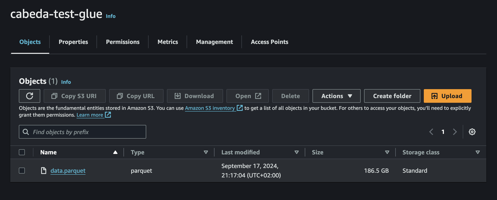
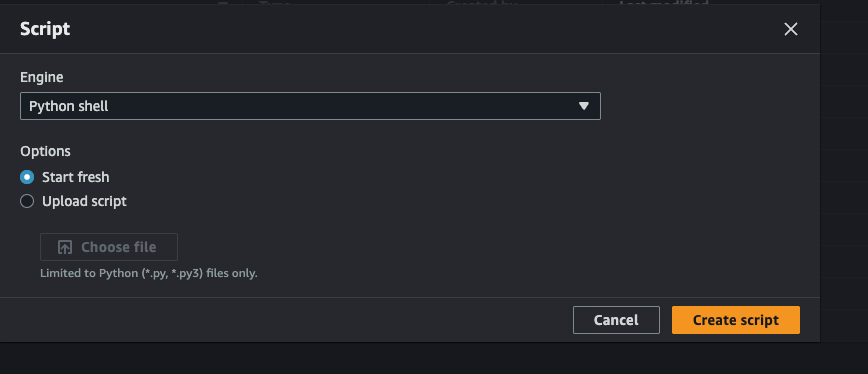

With my increasing use of AWS Glue, I wanted to test some features on the platform, particularly running DuckDB on a constrained instance. Initially, I thought the minimum requirement was 2 DPUs with a Spark environment setup. However, AWS Glue can scale down to a single DPU or even 1/16 DPUs if we forego Spark and just run [Glue Python scripts](https://docs.aws.amazon.com/glue/latest/dg/add-job-python.html). This led me to explore how useful this setup would be for a typical workload.

## The Test

For this article, I decided to:

1. Process a small dataset (1GB) using DuckDB and evaluate its performance.
2. Retrieve the dataset from an S3 bucket.
3. Process it and write it back to another S3 bucket.

All steps were run using the smallest DPU available (1/16 DPU) to see how it performs.



> Initially, I planned to run DuckDB through Ibis to provide a more user-friendly interface. However, [Ibis](https://ibis-project.org/) requires Python 3.9, while AWS Glue Python scripts run on Python 3.8.

## Running DuckDB Directly

I started by generating the dataset locally using the following SQL code ([source](https://duckdb.org/docs/guides/snippets/create_synthetic_data.html)):

```sql

SELECT hash(i * 10 + j) AS id, IF (j % 2, true, false)
                 FROM generate_series(1, 50) s(i)
                 CROSS JOIN generate_series(1, 5000000) t(j))
                 TO 'data.parquet'

```

Uploading a 2GB file was slow, so I decided to test how DuckDB would perform on AWS Glue by generating this file and uploading it to S3.

Using the AWS Console, I navigated to **AWS Glue > Create Job > Script Editor** and chose **Python shell** as my engine.



Before adding to the script we need two things:

1. Install DuckDB
2. Choose an IAM role (how to create one to use is out of scope for this article)

Additional libraries can be added to the script by setting the `--additional-python-modules` job parameter In my case, I added `DuckDB==1.1.0`.


With this setup, I was ready to test DuckDB.

To warm up, I tested if I could run the engine successfully with the following code:

```python

import DuckDB

DuckDB.sql("SELECT 1")

```

Success!

Now that DuckDB was running on Glue, I needed to ensure we could load extensions. For this test, I needed two extensions: `aws` to retrieve credentials and `httpfs` to upload and read from S3. I added a secret pointing to the credential chain (which uses the job's associated IAM role) and moved the SQL data generator inside a [COPY statement](https://DuckDB.org/docs/sql/statements/copy.html). The code is as follows:

```python

import DuckDB

DuckDB.sql("SET home_directory='/tmp';")

DuckDB.sql("""CREATE SECRET (
    TYPE S3,
    PROVIDER CREDENTIAL_CHAIN
);""")

DuckDB.sql("""
    COPY (
        SELECT hash(i * 10 + j) AS id, IF (j % 2, true, false)
        FROM generate_series(1, 50) s(i)
        CROSS JOIN generate_series(1, 5000000) t(j)
    ) 
    TO 's3://cabeda-test-glue/data_2GB.parquet'
""")
```

I ran the code locally with success, but encountered an error on Glue:

**`IOException: IO Error: Failed to create directory "/.DuckDB/": Permission denied`**

The issue was that Glue has a read-only filesystem, and the extensions were trying to write to the home directory. To fix this, I set the home directory to a writable location (/tmp). The final code looked like this:

```python

import DuckDB

DuckDB.sql("SET home_directory='/tmp';")

DuckDB.sql("""CREATE SECRET (
    TYPE S3,
    PROVIDER CREDENTIAL_CHAIN
);""")

DuckDB.sql("""
        COPY (
        SELECT hash(i * 10 + j) AS id, IF (j % 2, true, false)
         FROM generate_series(1, 50) s(i)
         CROSS JOIN generate_series(1, 5000000) t(j)
         ) 
         TO 's3://cabeda-test-glue/data_2GB.parquet'""")

```

Quite simple!

> Fun note: On my first run, the job took almost 30 minutes and generated a 186GB file instead of the expected 2GB. This demonstrated DuckDB's ability to handle scarce resources effectively.


## Accessing the Data

We proved that DuckDB can run on Glue and generate Parquet files. But can we access the data cost-effectively?

Thankfully, the Parquet extension and the `httpfs` extension are quite performant. I tested accessing the file, retrieving a subset of 1 million rows, and writing it back to another S3 bucket. The code is below:

```python

import duckDB

DuckDB.sql("SET home_directory='/tmp';")

DuckDB.sql("""CREATE SECRET (
    TYPE S3,
    PROVIDER CREDENTIAL_CHAIN
);""")

t = DuckDB.sql("SELECT * FROM 's3://cabeda-test-glue/data_2GB.parquet' LIMIT 1000000").df()

print(t.head())

DuckDB.sql("COPY t TO 's3://cabeda-test-glue/data_limit.parquet'")

```

This ran in just 30 seconds. Quite impressive!


## Final thoughts

Why use DuckDB inside a Glue job? DuckDB is powerful and can read S3 data and process it quickly for a fraction of the cost of a Spark job. For teams using AWS Glue to process files and facing high monthly bills, this is an easily swappable migration.

Personally, I hope this becomes a bigger trend as DuckDB gains the ability to read directly from the Glue Data Catalog and operate on Apache Iceberg tables. At that point, there's no reason to use Spark unless you're dealing with petabytes of data.
