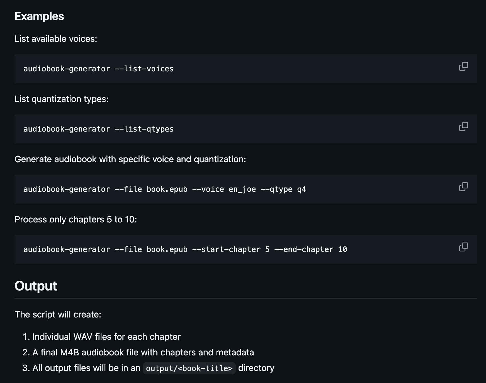

## Things I've done this week

- Got to visit Copenhagen and Malmö!
- Advanced just a little bit on the audibook generator. I've detected a lot of issues parsing the readeck articles. This means I should start to add unit tests to better debug this issues and avoid later regression errors.
- Built 10-minute PoC that processed four papers using duckdb + llama_index + ollama
- Trimmed the readeck list tto just a couple of papers to read + the latest radar from thoughtworks

## Reflections on the past week

First time visiting Copenhagen, and I really like the vibes of the city (vibes is a word being thrown around a lot this last weeks 🤖). Still in the middle of the trip but it's really nice to visit something during a longer stay in the country.

Am I a digital nomad? 🙃

One thing I'm having some doubts is on getting the audiobook generator in deno. It's nice to use it but I feel that I'd prefer to use python and use the typer/fastapi to get the CLI and the API. Plus the python library already has support for more languages and I feel copilot would help me a lot more on the development. The worst thing is that I wanted to enable running the package locally and the idea of using TS was to enable a seamless integration. I guess I'll have to experiment on using webassembly to bridge the gap 🤔

For now I've many changes on a separate branch [`deploy-package`](https://github.com/Cabeda/audiobook-generator/tree/deploy-package) which I've added but now I feel I'd prefer to refactor before deploying this to an actual package

I've also started dividing my ideas into a separate section. I'd like to write more about them but I'm now thinking between:

- talks
- quick demos
- oss projects

Demos are about having 1 hour to learn about something and build it as a way to learn. I'm hoping of doing a little bit like other developers I like to follow that have small articles where they write down their small findings. These eventually start to add up.

## Next week's plan

So I bit of reading still to do and a clear focus on improving the audiobok generator into a 0.0.1 release.

- Read the latest radar from thoughtworks
- I'll be sure to read the graphrag paper
- Migrate audiobook generator to python
- Add unit tests to fix the readeck parser
