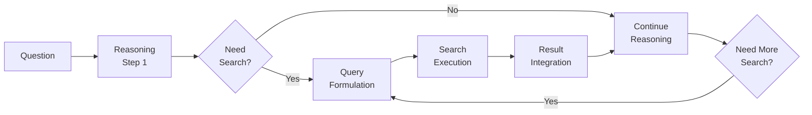
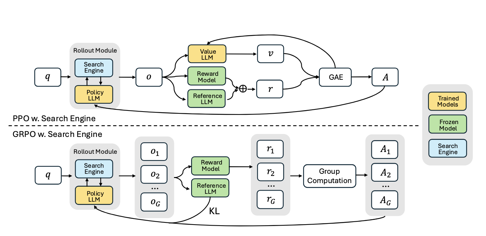
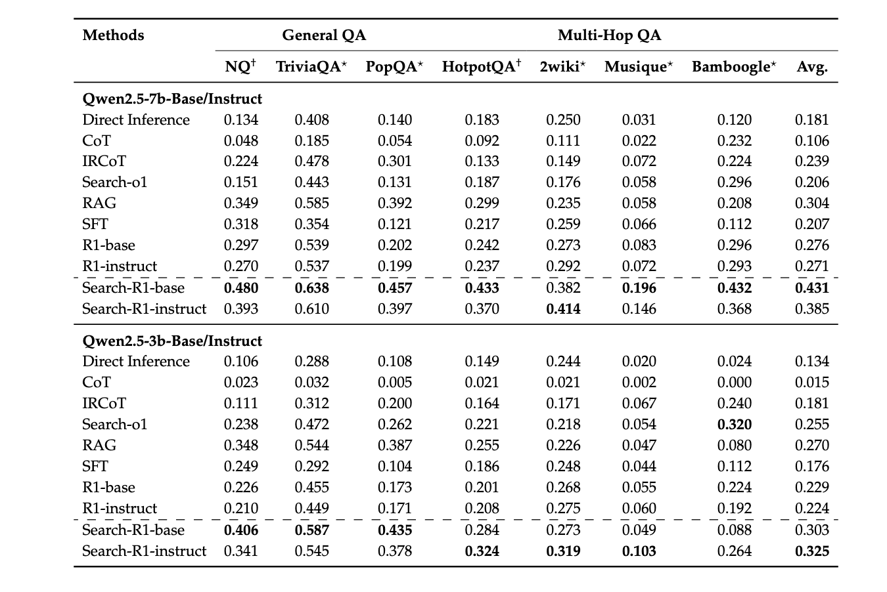
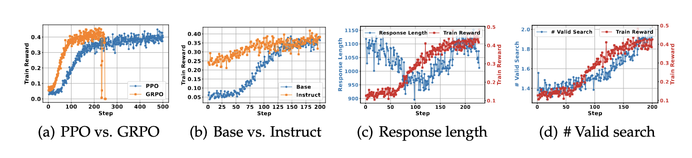
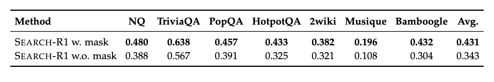

<!-- markdownlint-disable MD024 MD003 MD022-->
---
theme: academic
title: 'Search-R1: Training LLMs to Reason and Search with Reinforcement Learning'
author: José Cabeda
date: 2025-06-06
highlighter: shiki
lineNumbers: true
drawings:
  persist: false
transition: slide-left
css: unocss
---
---
layout: center
class: text-center
---

# Search-R1: Training LLMs to Reason and Search with Reinforcement Learning

---
layout: center
class: text-center
---

# Search-R1

---
layout: default
---

# The Problem: Static vs Dynamic Knowledge

<div grid="~ cols-2 gap-12">
<div>

## Traditional RAG Limitations

- **Fixed Retrieval**: Retrieve first, reason later
- **No Strategic Search**: Can't decide when to search
- **Limited Multi-hop**: Poor at complex reasoning chains
- **Static Queries**: No dynamic query formulation
- **Scalability Issues**: Rely on high-quality labeled trajectories

</div>
<div>

## What We Need

- **Interleaved Search**: Search during reasoning
- **Strategic Decisions**: When to search vs when to reason
- **Dynamic Queries**: Context-aware search formulation
- **Multi-hop Support**: Native complex reasoning

</div>
</div>

<!--
Traditional RAG systems have a fundamental limitation - they retrieve information upfront, regardless of whether it's actually needed for the reasoning process. Search-R1 addresses this by enabling models to make strategic decisions about when to search during their reasoning process.
-->

---
layout: image-right
---

# The Search-R1 Solution

## Interleaved Reasoning-Search Framework



Models learn **when** and **how** to search through Reinforcement Learning

Takes heavily inspiration from DeepSeek-R1

<!--
This diagram shows the core innovation of Search-R1 - instead of a linear retrieve-then-reason approach, the model can dynamically decide at each step whether to search for more information or continue reasoning with what it has.
-->

---

# Technical Architecture

<div grid="~ cols-2 gap-8">
<div>

## Core Components

### 1. RL Training Framework

- **PPO** (Proximal Policy Optimization) (Schulman et al., 201
- **GRPO** (Generalized Reward Policy Optimization) (Shao et al., 2024; Guo et al., 2025
- **Outcome-based rewards**: Exact match with ground truth

### 2. Search Engine Integration

- **Local Sparse**: BM25 + CPU processing
- **Local Dense**: E5 embeddings + GPU/ANN
- **Online APIs**: Google, SerpAPI, Bing, Brave

</div>
<div>

## Training Process

```python
for episode in training_episodes:
    # Generate reasoning-search sequence
    trajectory = model.generate_with_search(question)
    
    # Evaluate final answer 
    reward = calculate_reward(
        trajectory.answer, 
        ground_truth
    )
    
    # Update model with RL
    model.update_with_ppo(trajectory, reward)
```

</div>
</div>

<!--
The technical architecture is built around reinforcement learning, where the model learns to optimize its search strategy through trial and error, receiving rewards based on whether its final answers are correct.
-->

---
layout: center
class: text-center
---

# Reward architecture



---
layout: center
class: text-center
---

# Experimental Results: Impressive Gains

<div class="text-6xl text-green-500 font-bold mb-8">
  41% & 20%
</div>

<div class="text-2xl mb-8">
  Average relative improvement for Quwen 7B and 3B models respectively
</div>

<div grid="~ cols-3 gap-8 text-lg">
<div class="border rounded p-4">

**General QA**

- Natural Questions
- TriviaQA  
- PopQA

</div>
<div class="border rounded p-4">

**Multi-Hop QA**

- HotpotQA
- 2WikiMultiHopQA
- Musique
- Bamboogle

</div>
<div class="border rounded p-4">

**Key Findings**

- Consistent outperformance
- Strong generalization
- Scale benefits (7B > 3B)
- Works on base & instruct models

</div>
</div>

<!--
The experimental results are quite impressive - Search-R1 shows consistent improvements across both simple and complex multi-hop question answering tasks, with larger models showing particularly strong benefits from learning search strategies.
-->

---
layout: two-cols
---

## Real-World Example

<div class="text-sm">

**Question**: "What is the population of the capital of the country where Mount Everest is located?"

**Search-R1 Process**:

1. **Reasoning**: "I need to find where Mount Everest is located"

2. **🔍 Search**: "Mount Everest location country"
   **Results**: "Mount Everest is on the border of Nepal and Tibet..."

3. **Reasoning**: "Mount Everest is in Nepal. Now I need Nepal's capital"

4. **🔍 Search**: "capital of Nepal"  
   **Results**: "Kathmandu is the capital of Nepal..."

5. **Reasoning**: "Now I need Kathmandu's population"

6. **🔍 Search**: "Kathmandu population current"
   **Results**: "Kathmandu has approximately 1.4 million people..."

7. **Final Answer**: "Approximately 1.4 million people"

</div>

::right::

## vs Traditional RAG

<div class="text-sm">

**Traditional RAG Process**:

1. **🔍 Search**: "population capital country Mount Everest located"
   **Results**: Mixed results about mountains, capitals, populations...

2. **Reasoning**: "Based on these results... Mount Everest... Nepal... Kathmandu... population..."
   **Likely Outcome**: ❌ Confusion or wrong answer

<div class="mt-8 p-4 bg-green-900 rounded">

**Why Search-R1 Wins**:

- ✅ Strategic, step-by-step information gathering
- ✅ Context-aware query formulation  
- ✅ Builds knowledge incrementally
- ✅ Each search informs the next step

</div>

</div>

<!--
This example perfectly illustrates why Search-R1 is so powerful - it can break down complex multi-hop questions into a series of targeted searches, each building on the previous knowledge to get to the final answer.
-->

---
layout: default
---

# Open Source Implementation

<div grid="~ cols-2 gap-8">
<div>

## Installation & Setup

```bash
# Main environment
conda create -n searchr1 python=3.9
conda activate searchr1
pip install torch==2.4.0 \
  --index-url https://download.pytorch.org/whl/cu121
pip3 install vllm==0.6.3
pip install -e .
pip3 install flash-attn --no-build-isolation
pip install wandb
```

```bash
# Retriever environment (optional)
conda create -n retriever python=3.10
conda activate retriever
pip install transformers datasets pyserini
conda install -c pytorch -c nvidia faiss-gpu=1.8.0
pip install uvicorn fastapi
```

</div>
<div>

## Quick Start Options

### Local BM25 Search

```bash
python search_r1/search/retrieval_server.py \
  --index_path $save_path/bm25 \
  --corpus_path $save_path/wiki-18.jsonl \
  --topk 3 --retriever_name bm25
```

### Dense Retrieval (GPU)

```bash
python search_r1/search/retrieval_server.py \
  --index_path $save_path/e5_Flat.index \
  --corpus_path $save_path/wiki-18.jsonl \
  --topk 3 --retriever_name e5 \
  --retriever_model intfloat/e5-base-v2 --faiss_gpu
```

### Online Search (SerpAPI)

```bash
python search_r1/search/serp_search_server.py \
  --search_url https://serpapi.com/search \
  --topk 3 --serp_api_key YOUR_API_KEY
```

</div>
</div>

<!--
One of the great things about this research is that it's completely open source with comprehensive documentation and multiple deployment options, making it accessible for both researchers and practitioners.
-->

---
layout: default
---

<AutoFitText :max="200" :min="10">

# Comparison with State-of-the-Art

| Aspect | Traditional RAG | DeepSeek-R1 | OpenAI DeepResearch | **Search-R1** |
|--------|----------------|-------------|-------------------|----------------|
| **Search Timing** | Pre-reasoning | No search | During reasoning | ✅ During reasoning |
| **Search Strategy** | Fixed | N/A | Proprietary | ✅ Learned via RL |
| **Multi-hop Support** | Limited | Good | Good | ✅ Native |
| **Query Formulation** | Static | N/A | Unknown | ✅ Dynamic/contextual |
| **Open Source** | Varies | ✅ Yes | ❌ No | ✅ **Yes** |
| **Tool Integration** | Limited | ❌ No | ✅ Yes | ✅ **Yes** |
| **Transparency** | Medium | High | Low | ✅ **High** |
| **Customization** | Medium | High | Low | ✅ **High** |

</AutoFitText>

<!--
This comparison shows how Search-R1 positions itself uniquely in the landscape - combining the best of reasoning capabilities with strategic search, all while remaining completely open source and customizable.
-->

---
layout: center
class: text-center
---

# Results



---
layout: center
class: text-center
---

# Results GRPO vs PPO



- GRPO converges faster than PPO across all cases. This is because PPO relies on a critic model, which requires several warm-up steps before effective training begins.
- PPO demonstrates greater training stability. As shown in Figure 2(a), GRPO leads to reward collapse after training for many steps, whereas PPO remains stable.
- The final training rewards of PPO and GRPO are comparable

****

---
layout: center
class: text-center
---

# Results token loss masking



---
layout: center
class: text-center
---

# Future Directions & Limitations

<div grid="~ cols-2 gap-12">
<div>

## Current Challenges

<div class="text-left space-y-4">

🔴 **Search Cost**: Multiple API calls can be expensive

🔴 **Latency**: Interactive search adds response time  

🔴 **Quality Control**: May search unnecessarily or formulate poor queries

🔴 **Scalability**: Training RL models is computationally intensive

</div>

</div>
<div>

## Potential Improvements

<div class="text-left space-y-4">

🟢 **Search Efficiency**: Learning when NOT to search

🟢 **Query Optimization**: Better query formulation strategies

🟢 **Result Filtering**: Intelligent selection of relevant information

🟢 **Multi-modal Search**: Integration with image and video search

🟢 **Cost Optimization**: Balancing search calls with accuracy

</div>

</div>
</div>

<div class="mt-12 p-6 bg-gradient-to-r from-blue-500 to-green-500 rounded-lg">
<strong>Bottom Line</strong>: Search-R1 provides a more generic alternative to traditional RAG approaches
</div>

<!--
While Search-R1 shows impressive results, there are still important challenges to address, particularly around cost and efficiency. The future directions are quite exciting, especially multi-modal search capabilities.
-->

---
layout: end
class: text-center
---

# Thank You

## Questions & Discussion

<div class="mt-8 space-y-4">

🔗 **Arxiv**: [arxiv.org/abs/2503.09516](https://arxiv.org/pdf/2503.09516)

🐙 **Code**: [github.com/PeterGriffinJin/Search-R1](https://github.com/PeterGriffinJin/Search-R1)

</div>

<div class="abs-br m-6 flex gap-2">
  <a href="https://github.com/PeterGriffinJin/Search-R1" target="_blank" alt="GitHub"
    class="text-xl icon-btn opacity-50 !border-none !hover:text-white">
    <carbon-logo-github />
  </a>
</div>
